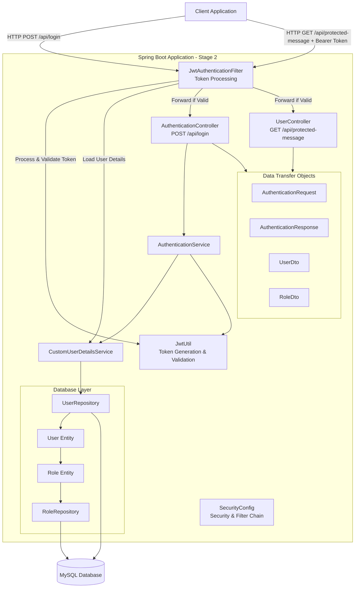
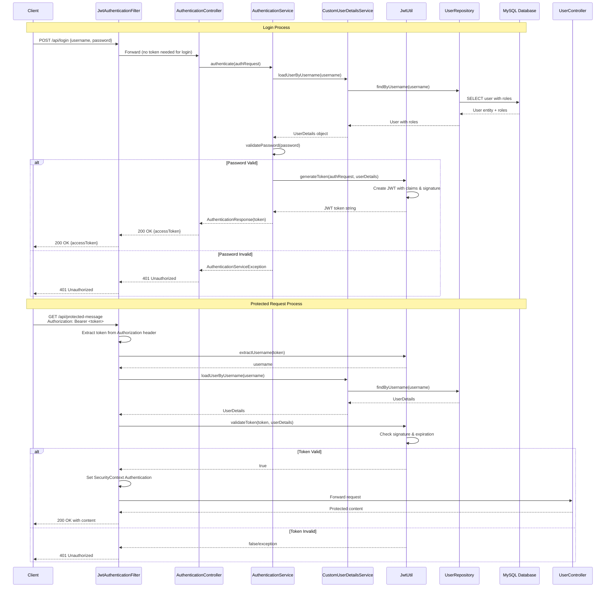
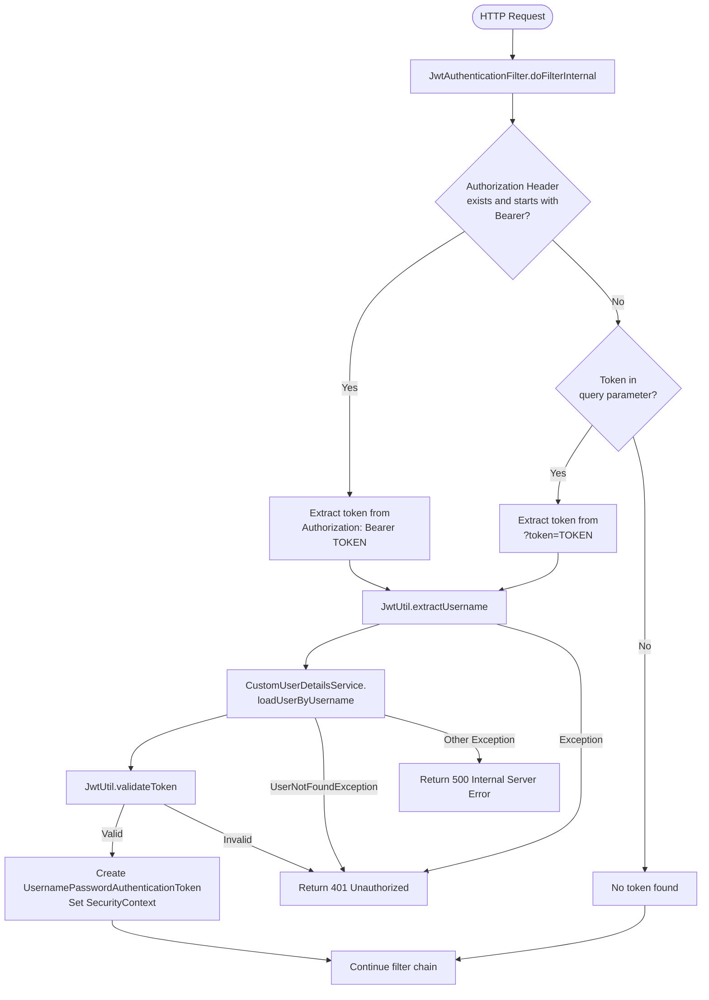
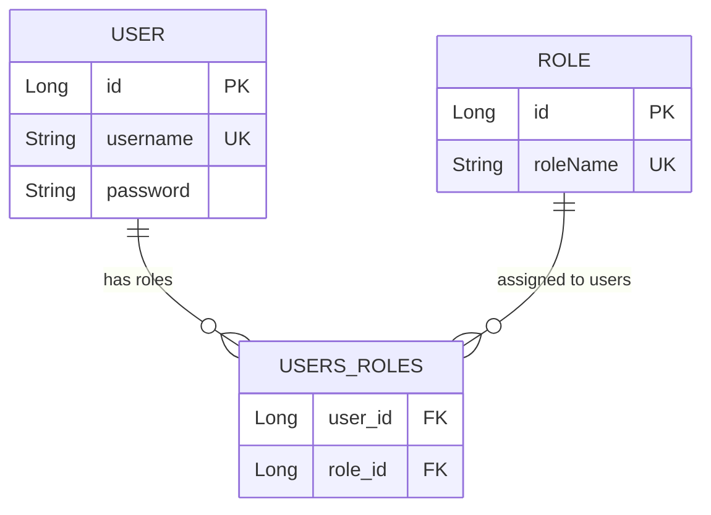
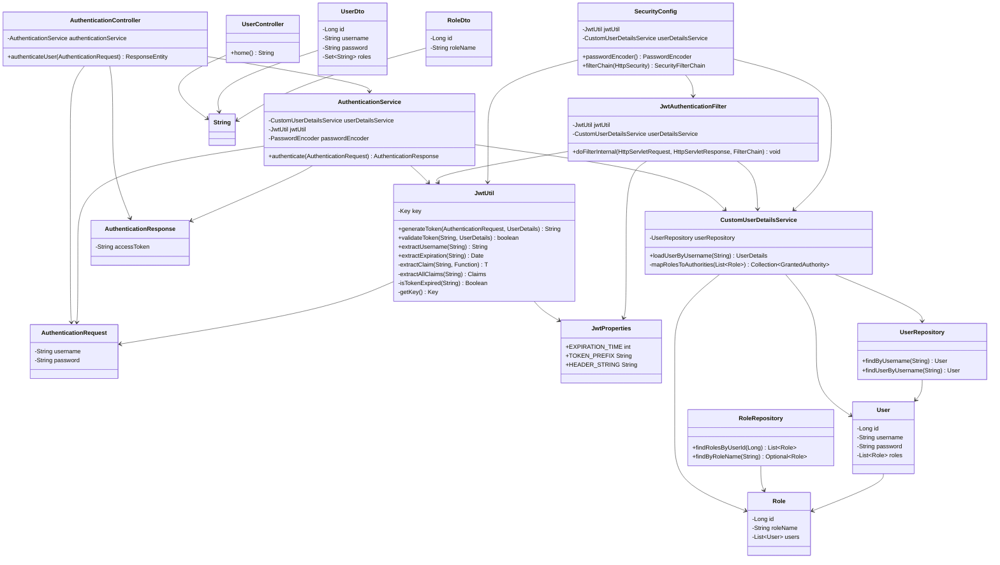
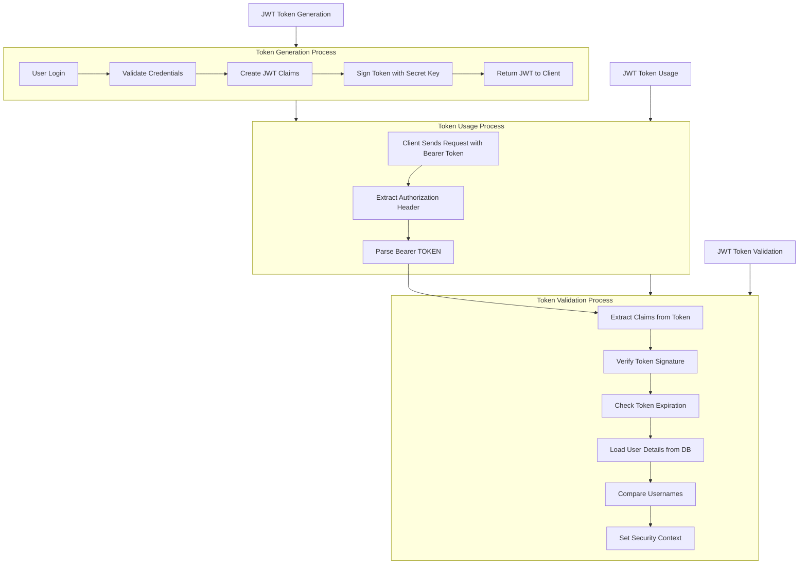
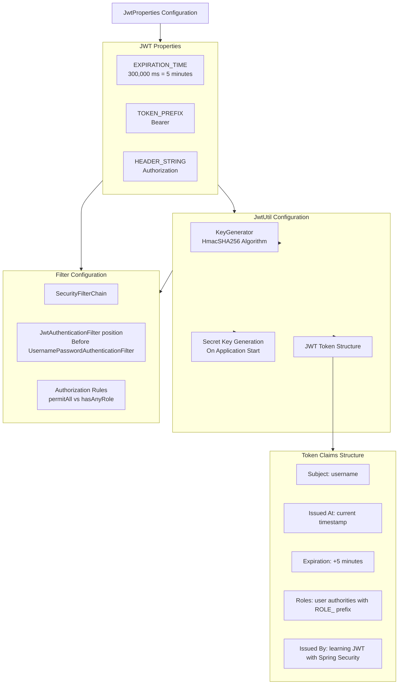
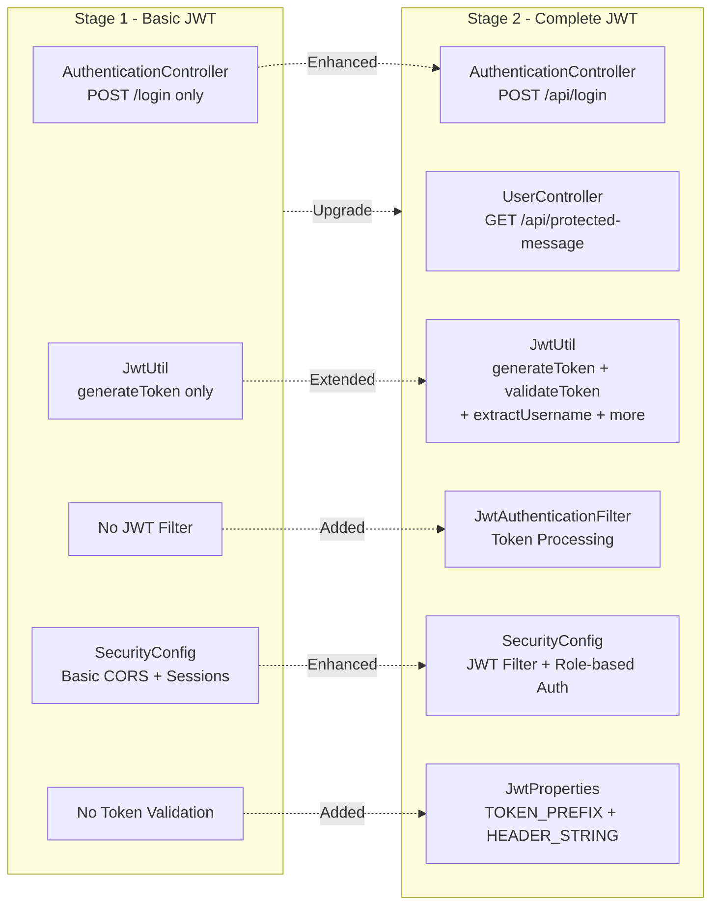

# תיעוד Stage 2 - JWT System Documentation

## השוואה בין Stage 1 ל-Stage 2

### מה היה ב-Stage 1:
- JWT Token Generation בלבד
- אין JWT Authentication Filter
- אין Token Validation
- endpoints לא מוגנים בפועל
- אין Authorization headers processing

### מה נוסף ב-Stage 2:
- **JwtAuthenticationFilter** - מעבד tokens בכל בקשה
- **Token Validation** - בודק תקינות ותפוגה של tokens
- **Protected Endpoints** - endpoints מוגנים באמת
- **Authorization Header Processing** - קריאת Bearer tokens (נושא) 
- **Role-based Access Control** - הגבלות על בסיס תפקידים
- **SecurityContext Management** - ניהול אימות ברמת הבקשה

## תרשים ארכיטקטורת המערכת - System Architecture

## תרשים זרימת Authentication מלאה - Complete Authentication Flow

## תרשים JWT Filter Processing - JWT Filter Flow

## תרשים יחסי ישויות - Entity Relationship Diagram

## תרשים מחלקות - Class Diagram

## זרימת עיבוד JWT - JWT Processing Flow

## הגדרות JWT ב-Stage 2 - JWT Configuration

## השוואת ההבדלים בקוד - Code Differences

## מתודולוגיית הAuth ב-Stage 2

### 1. Token Generation
- משתמש מתחבר עם username/password
- המערכת מאמתת פרטים מול DB
- JwtUtil יוצר token חתום עם claims
- Token מוחזר ללקוח

### 2. Token Usage
- לקוח שולח token ב-Authorization header
- JwtAuthenticationFilter מיירט כל בקשה
- מחלץ token מ-"Bearer TOKEN"
- מאמת token ומטען SecurityContext

### 3. Protected Access
- Spring Security בודק SecurityContext
- מאפשר גישה על בסיס roles
- hasAnyRole("USER", "ADMIN") לendpoints מוגנים

### 4. Token Validation
- בדיקת חתימה דיגיטלית
- בדיקת תפוגה (5 דקות)
- בדיקת username matching
- טיפול בשגיאות עם 401/500

