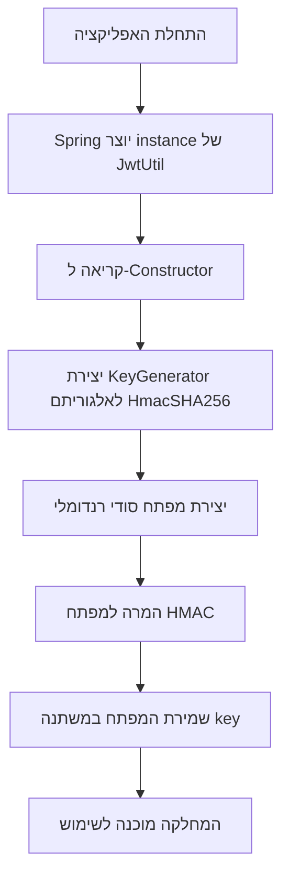
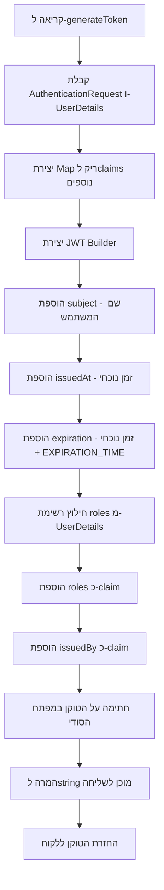
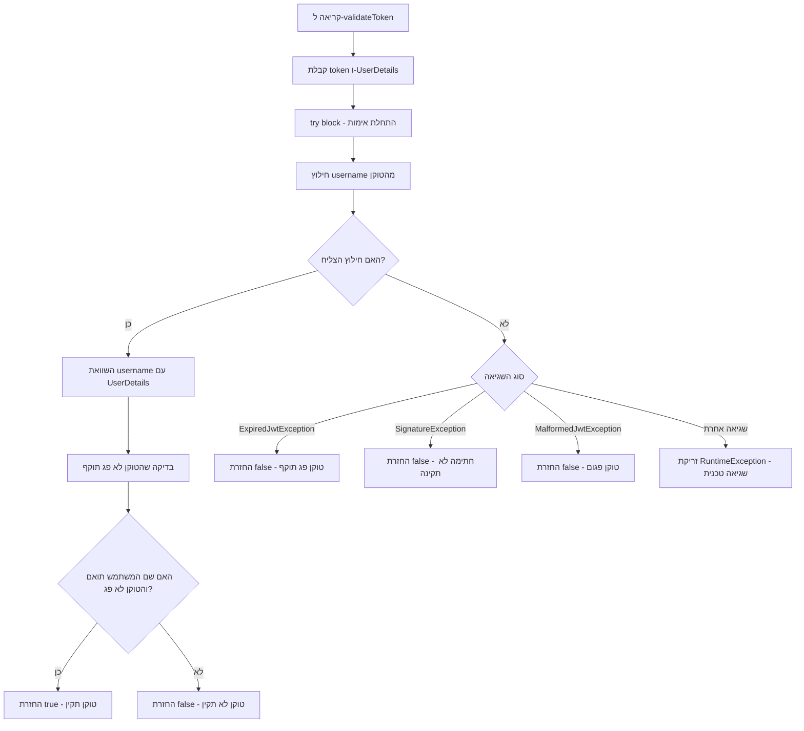
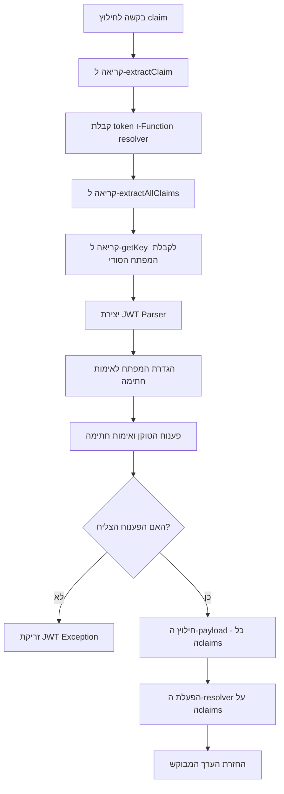
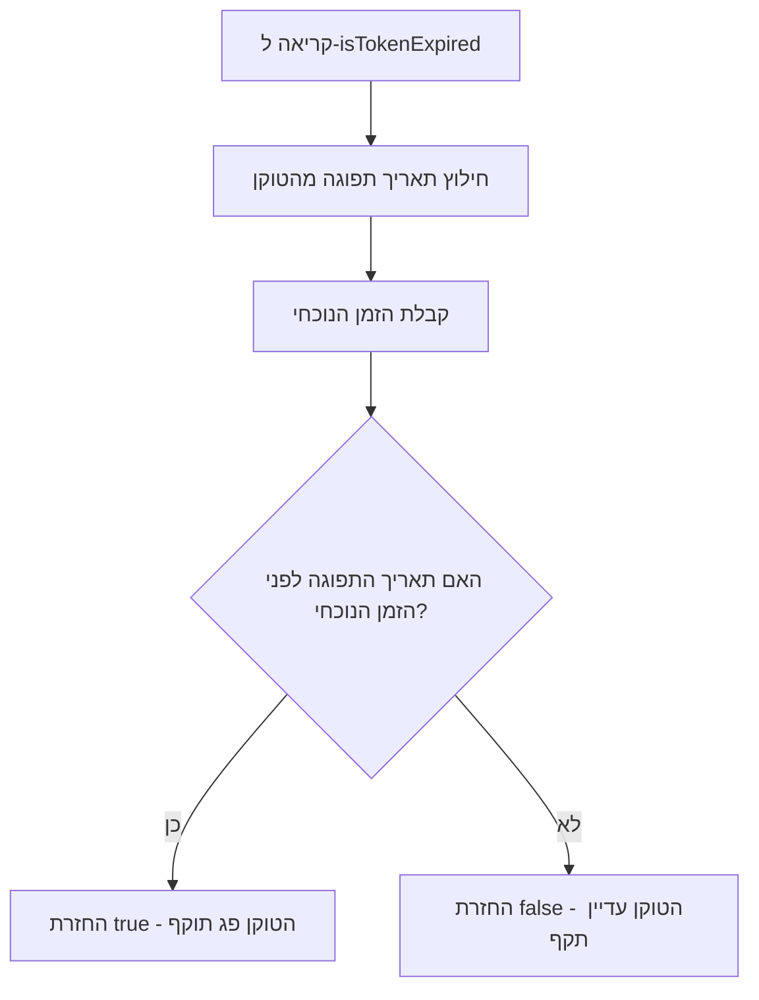
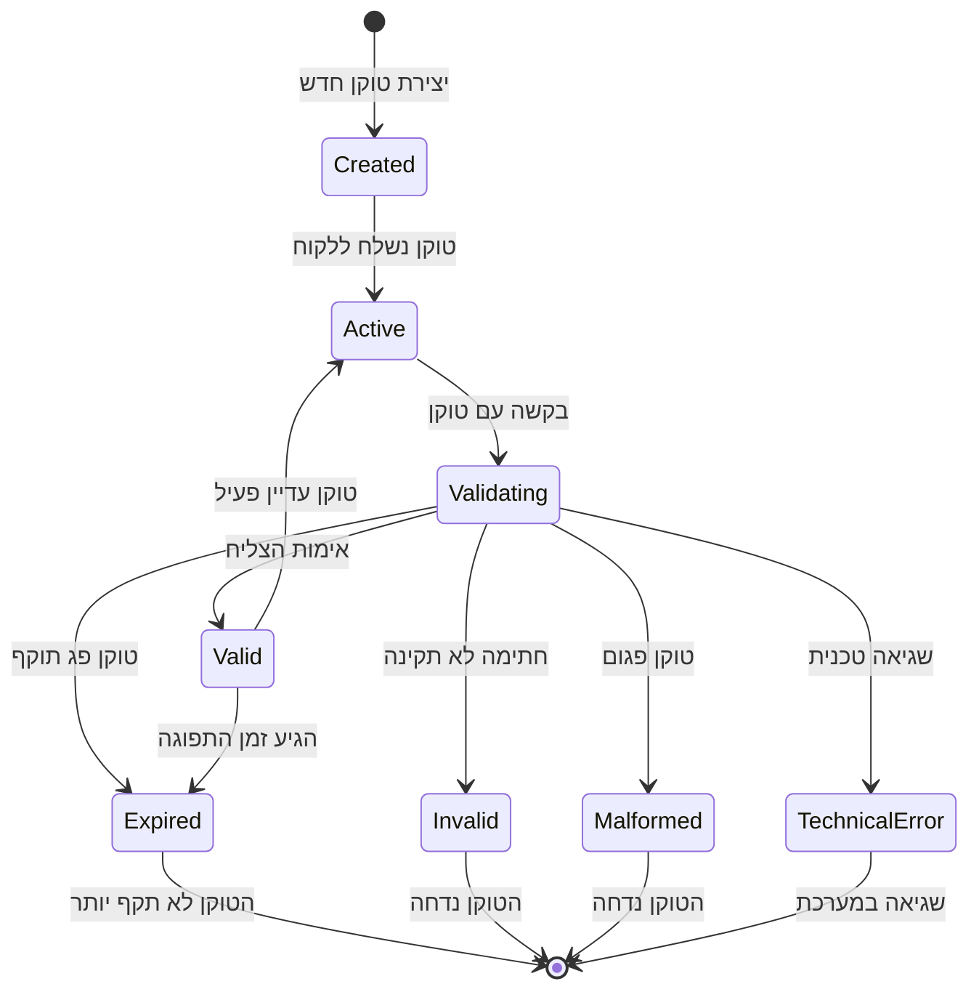
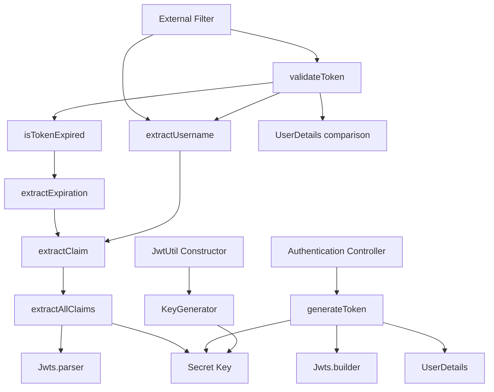
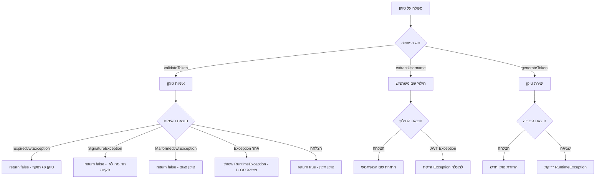

# תיעוד מחלקת JwtUtil עם תרשימי תהליכים

<div dir="rtl">

## הקדמה

### מה זה JwtUtil?

**JwtUtil** היא מחלקת עזר מרכזית המטפלת בכל הפעולות הקשורות ל-JSON Web Tokens (JWT) באפליקציית Spring Boot. המחלקה אחראית על יצירה, אימות וחילוץ מידע מטוקנים.

### תפקידי המחלקה

המחלקה מספקת את השירותים הבאים:
- **יצירת טוקנים חדשים** - בעת הרשמה או כניסה של משתמשים
- **אימות טוקנים קיימים** - בדיקה שהטוקן תקין, לא פג תוקף ולא זויף
- **חילוץ מידע מטוקנים** - קבלת שם משתמש, תאריך תפוגה ונתונים נוספים
- **ניהול מפתח הצפנה** - יצירה ושמירה של המפתח הסודי

### רכיבים עיקריים

1. **Secret Key** - מפתח הצפנה ייחודי לכל הפעלה של האפליקציה
2. **Token Generation** - יצירת טוקנים עם claims מותאמים אישית
3. **Token Validation** - אימות הטוקן כולל חתימה ותוקף
4. **Claims Extraction** - חילוץ נתונים ספציפיים מהטוקן

---

## 1. אתחול המחלקה ויצירת המפתח

### הסבר התהליך
כאשר האפליקציה נטענת, Spring יוצר instance של JwtUtil. בconstructor מתבצעת יצירה של מפתח הצפנה ייחודי שישמש לכל הטוקנים באפליקציה.

**חשיבות המפתח:**
- כל טוקן נחתם במפתח הזה
- בלי המפתח הנכון אי אפשר לאמת או ליצור טוקנים
- המפתח נוצר רנדומלית בכל הפעלה (לא שמור בקובץ)



---

## 2. תהליך יצירת טוקן חדש

### הסבר התהליך
כאשר משתמש מתחבר בהצלחה, המערכת יוצרת טוקן JWT חדש שמכיל את פרטי המשתמש והרשאותיו. הטוקן נחתם במפתח הסודי ונשלח ללקוח.

**מה כלול בטוקן:**
- **Subject** - שם המשתמש
- **IssuedAt** - מתי הטוקן נוצר
- **Expiration** - מתי הטוקן יפוג
- **Roles** - הרשאות המשתמש
- **Custom Claims** - מידע נוסף כמו "issuedBy"



---

## 3. תהליך אימות טוקן

### הסבר התהליך
כאשר לקוח שולח בקשה עם טוקן, המערכת צריכה לוודא שהטוקן תקין. התהליך כולל בדיקת חתימה, תוקף ושם משתמש.

**שלבי האימות:**
1. **חילוץ שם המשתמש** מהטוקן
2. **השוואה** עם שם המשתמש ב-UserDetails
3. **בדיקת תוקף** - שהטוקן לא פג
4. **אימות חתימה** - שהטוקן לא זויף

**טיפול בשגיאות:**
- טוקן פג תוקף → `false`
- חתימה לא תקינה → `false`
- טוקן פגום → `false`
- שגיאה טכנית → `RuntimeException`



---

## 4. מנגנון חילוץ Claims

### הסבר התהליך
JWT מכיל מידע מקודד שנקרא Claims. כדי לגשת למידע הזה, צריך לפענח את הטוקן ולחלץ את הנתונים הרצויים.

**סוגי Claims נפוצים:**
- **Subject** - שם המשתמש
- **Expiration** - תאריך תפוגה
- **IssuedAt** - תאריך יצירה
- **Roles** - הרשאות משתמש



---

## 5. בדיקת תוקף הטוקן

### הסבר התהליך
כל טוקן JWT יש לו תאריך תפוגה. הבדיקה משווה את תאריך התפוגה עם הזמן הנוכחי.



---

## 6. מחזור חיי הטוקן

### הסבר התרשים
תרשים זה מראה את כל המצבים שטוקן יכול להיות בהם מרגע יצירתו ועד השמדתו.



---

## 7. ארכיטקטורת המחלקה

### הסבר התרשים
תרשים זה מראה איך המתודות במחלקה קוראות זו לזו ואיך הן מתקשרות עם רכיבים חיצוניים.



---

## 8. טיפול בשגיאות ברמות שונות

### הסבר התהליך
המחלקה מבדילה בין סוגי שגיאות שונים ומטפלת בהם בהתאם לחומרתן.



---

## סיכום ועקרונות מנחים

### עקרונות תכנון המחלקה

1. **Single Responsibility** - המחלקה עוסקת רק בJWT, לא באימות משתמשים
2. **Fail Fast** - שגיאות מתגלות מיד ולא מסתתרות
3. **Clear Error Handling** - הבדלה ברורה בין שגיאות אימות לשגיאות טכניות
4. **Stateless Operations** - כל פעולה עצמאית, לא תלויה במצב קודם

### דפוסי שימוש נפוצים

**ביצירת טוקן:**

</div>

```java
// בController של Authentication
String token = jwtUtil.generateToken(authRequest, userDetails);
```

<div dir="rtl">

**באימות טוקן:**

</div>

```java
// בJWT Filter
if (jwtUtil.validateToken(token, userDetails)) {
    // הגדרת authentication
}
```

<div dir="rtl">

**בחילוץ מידע:**

</div>

```java
// בכל מקום שצריך את שם המשתמש
String username = jwtUtil.extractUsername(token);
```

<div dir="rtl">

### שיקולי ביטחון חשובים

1. **מפתח רנדומלי** - נוצר מחדש בכל הפעלה של האפליקציה
2. **אימות חתימה** - כל טוקן נבדק שלא זויף
3. **בדיקת תוקף** - טוקנים פגי תוקף נדחים אוטומטית
4. **טיפול בשגיאות** - לא חושף מידע רגיש בהודעות שגיאה

### נקודות לשיפור אפשריות

1. **שמירת מפתח קבוע** - כרגע המפתח משתנה בכל הפעלה
2. **הגדרת זמני תוקף גמישים** - לפי סוג משתמש או פעולה
3. **רישום שגיאות** - לוגים מפורטים לצורכי אבחון
4. **תמיכה בrefresh tokens** - לחידוש טוקנים בלי התחברות מחדש

</div>