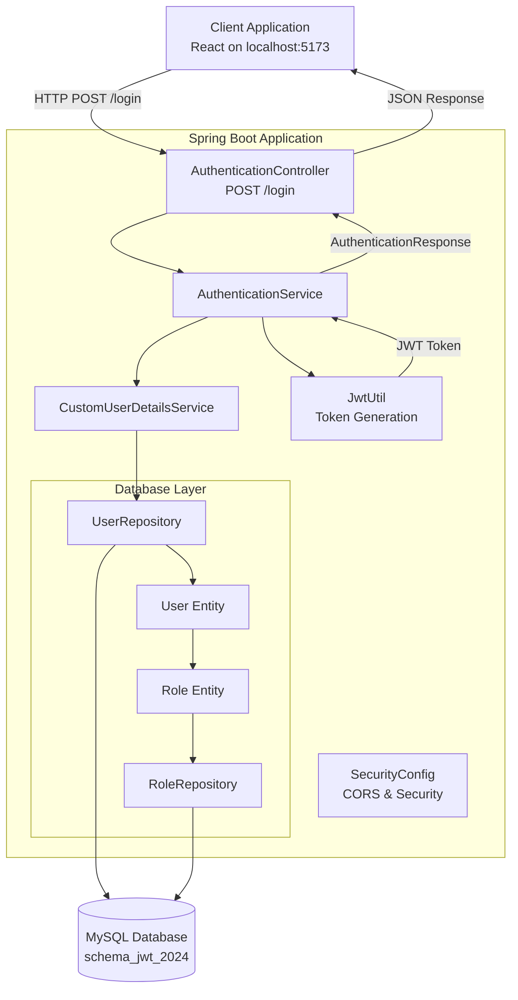
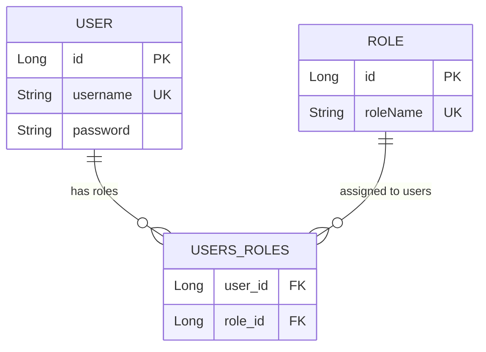
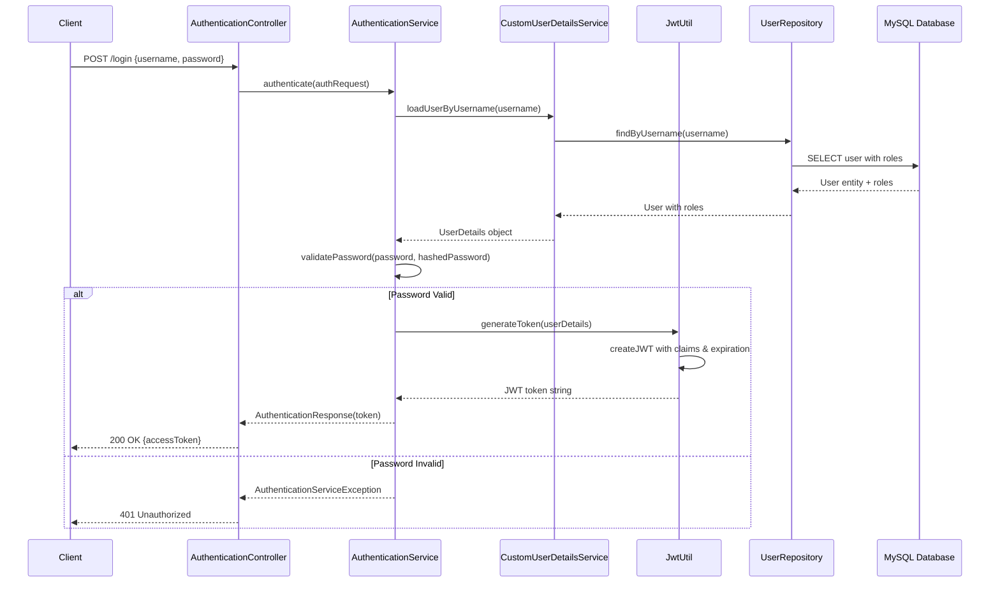
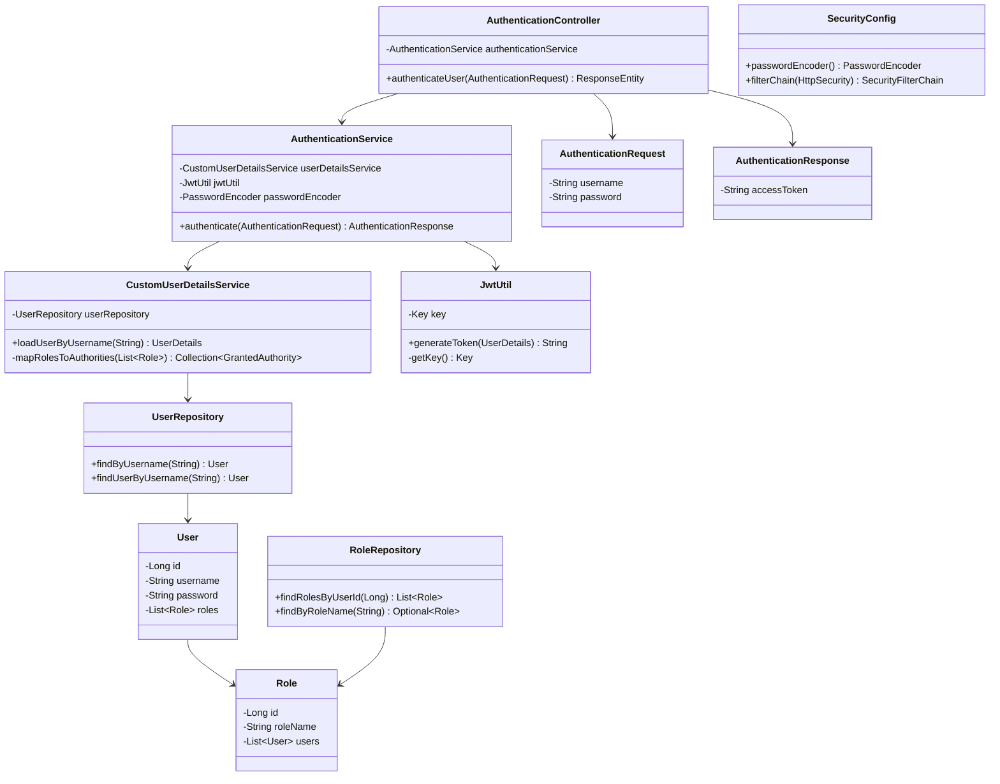
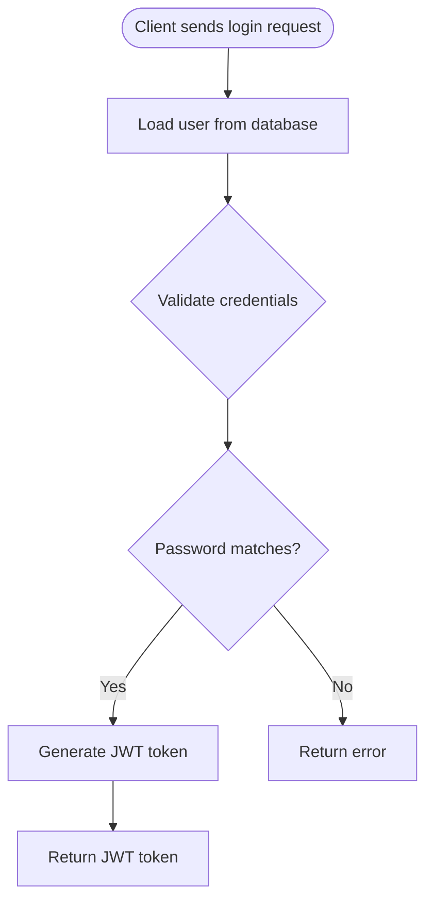
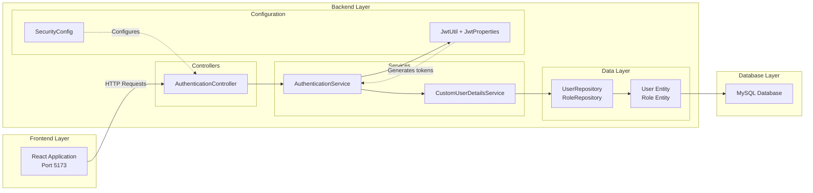
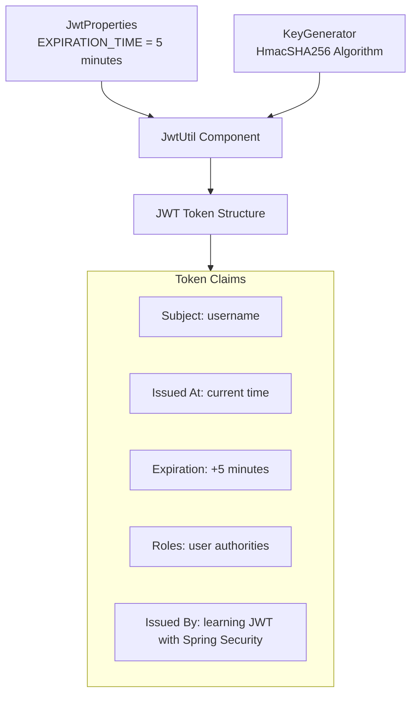
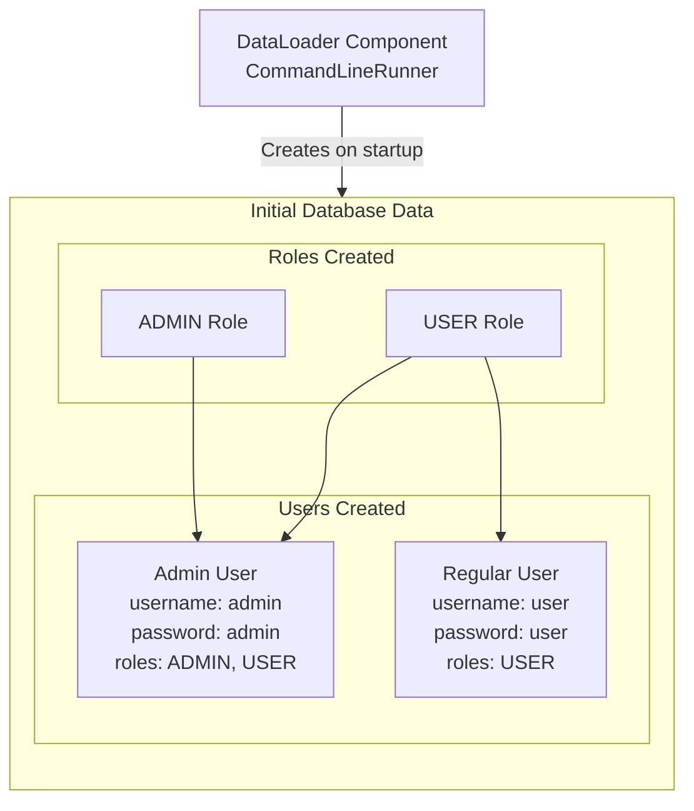

# תיעוד מערכת JWT - JWT System Documentation

## תרשים ארכיטקטורת המערכת - System Architecture

## תרשים יחסי ישויות - Entity Relationship Diagram

## זרימת תהליך האימות - Authentication Flow

## תרשים מחלקות - Class Diagram

## תרשים זרימת נתונים - Data Flow Diagram

## תרשים רכיבי המערכת - System Components

## הגדרות JWT - JWT Configuration

## נתוני בסיס הנתונים הראשוניים - Initial Data Setup

