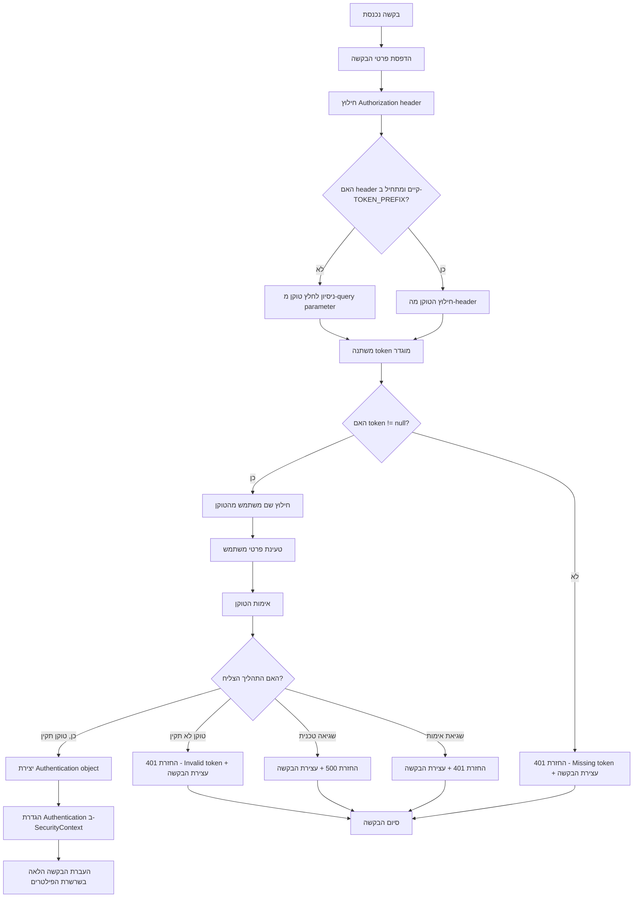
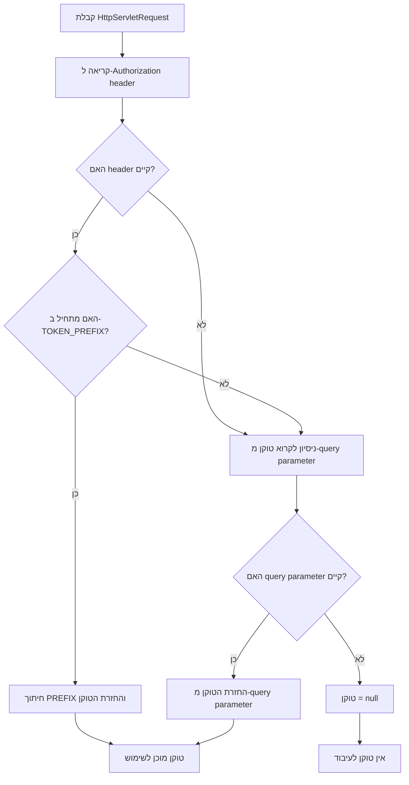
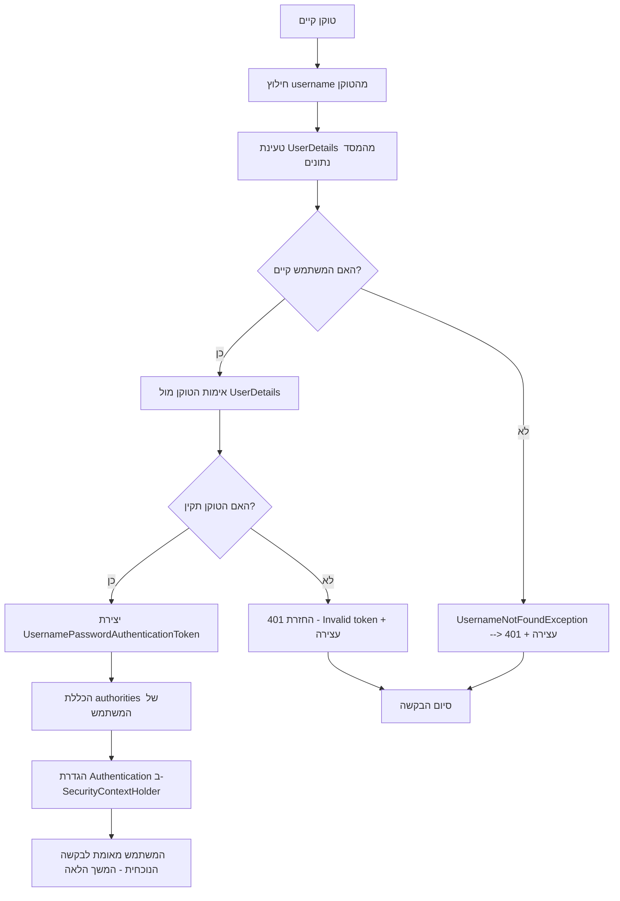
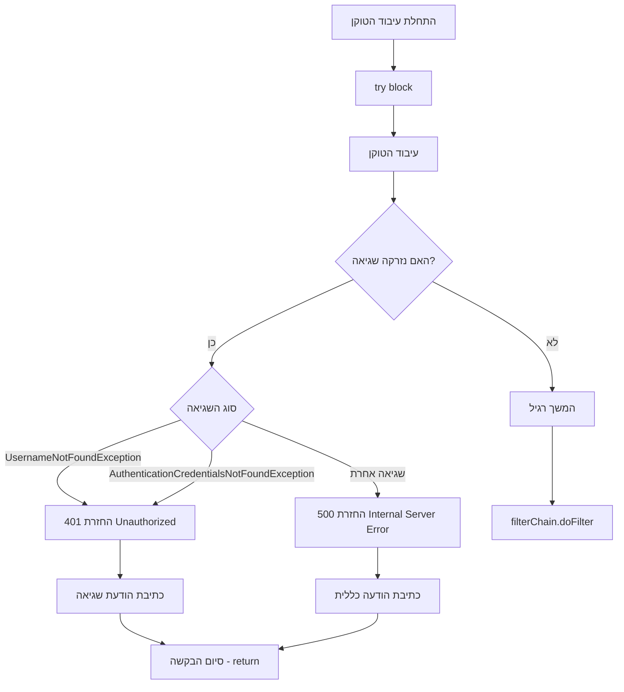
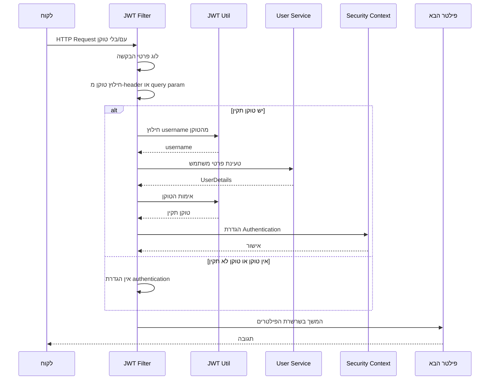
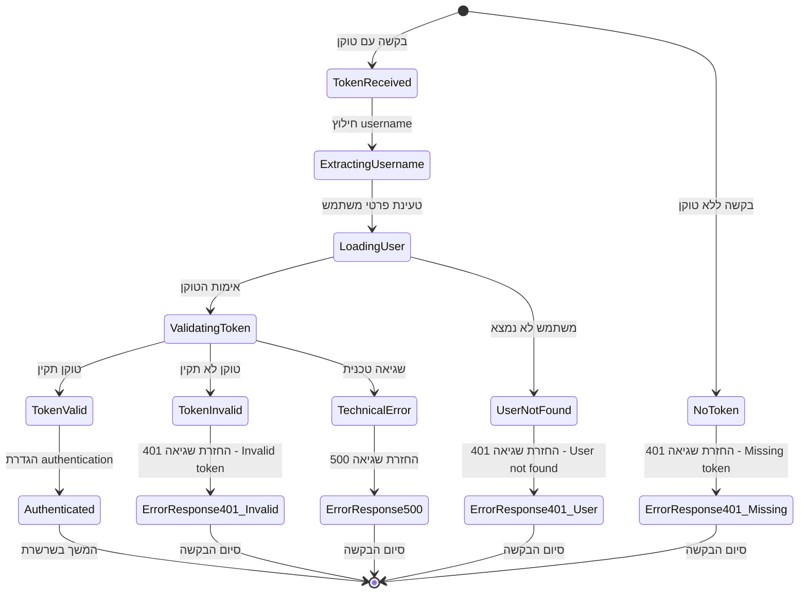
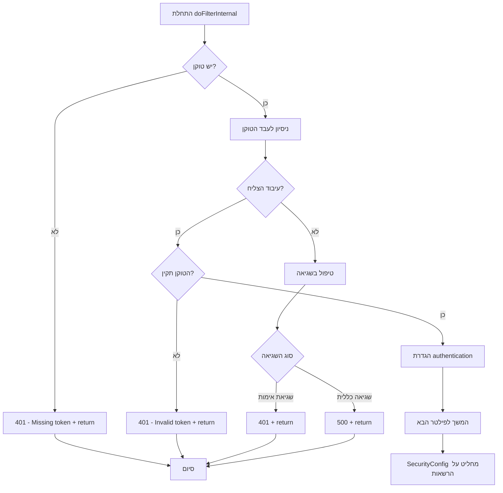

<div dir="rtl">

# תרשימי תהליכים - JWT Authentication Filter

## הקדמה

### מה זה JWT Authentication Filter?

ה-**JWT Authentication Filter** הוא רכיב מרכזי במערכת אבטחה של Spring Boot שמטפל באימות באמצעות JSON Web Tokens. הפילטר פועל כשכבת ביניים בין הבקשות הנכנסות לבין הקוד העסקי של האפליקציה.

### תפקיד הפילטר

הפילטר מבצע את הפעולות הבאות בכל בקשה נכנסת:
- **זיהוי טוקן JWT** - מחפש טוקן ב-Authorization header או ב-query parameter
- **אימות הטוקן** - בודק שהטוקן תקין, לא פג תוקף ולא זויף
- **חילוץ פרטי משתמש** - מוציא את שם המשתמש מהטוקן וטוען את פרטיו המלאים
- **הגדרת Security Context** - מגדיר את המשתמש כמאומת עבור הבקשה הנוכחית

### עקרונות חשובים

1. **Stateless** - הפילטר לא שומר מידע בין בקשות
2. **Mandatory Token** - כל בקשה חייבת להכיל טוקן תקין, אחרת הפילטר מחזיר 401
3. **Single Responsibility** - הפילטר רק מאמת ומגדיר authentication, לא מחליט על הרשאות
4. **Clear Response Codes** - מטפל בשגיאות בצורה מבוקרת ומחזיר קודי שגיאה מתאימים

### זרימת הבקשה הכללית

</div>

```
בקשה → JWT Filter → Security Config → Controller
```

<div dir="rtl">

הפילטר רץ לפני שSpring Security בודק הרשאות, כך שהוא יכול להגדיר מי המשתמש המאומת לפני שמתקבלות החלטות על גישה למשאבים. בגישה הקפדנית, רק בקשות עם טוקן תקין מגיעות ל-SecurityConfig ולקוד העסקי.

## 1. תהליך כללי של הפילטר

### הסבר התרשים
התרשים מתאר את הזרימה המלאה של הפילטר מרגע קבלת הבקשה ועד העברתה הלאה. זהו התהליך העיקרי שרץ בכל בקשה שמגיעה לשרת.

**נקודות מפתח:**
- הפילטר תמיד רץ, גם אם אין טוקן
- אם אין טוקן תקין, הפילטר פשוט לא מגדיר authentication




## 2. תהליך חילוץ הטוקן

### הסבר התרשים
תרשים זה מראה כיצד הפילטר מחפש את הטוקן בשני מקומות שונים בבקשה. זוהי גמישות שמאפשרת שימוש בטוכנולוגיות שונות.

**עדיפויות:**
1. **Authorization Header** - הדרך המועדפת והסטנדרטית
2. **Query Parameter** - לשימוש במקרים מיוחדים (WebSocket, file downloads)


</div>

**Header:** `Authorization: Bearer <token>`

**Query:** `?token=<token>`

<div dir="rtl">

**למה שתי דרכים?**
- Headers לא תמיד זמינים (במיוחד ב-WebSocket או בקישורי הורדת קבצים)
- Query parameters קלים יותר לשימוש בקישורים ישירים



## 3. תהליך אימות הטוקן

### הסבר התרשים
זהו הליבה של הפילטר - התהליך שבו אנחנו מוודאים שהטוקן אכן תקין ושייך למשתמש קיים במערכת.

**שלבי האימות:**
1. **חילוץ Username** - הטוקן מכיל בתוכו את שם המשתמש מוצפן
2. **טעינת UserDetails** - מהמסד נתונים או מקור נתונים אחר
3. **אימות הטוקן** - בדיקה שהטוקן לא זויף, לא פג תוקף ושייך למשתמש הנכון

**מה קורה בהצלחה?**
- נוצר `UsernamePasswordAuthenticationToken`
- הוא מכיל את פרטי המשתמש ואת ההרשאות שלו
- הוא נשמר ב-`SecurityContextHolder` עבור הבקשה הנוכחית
- הבקשה ממשיכה לפילטר הבא

**מה קורה בכישלון?**
- אם המשתמש לא קיים → 401 ועצירת הבקשה
- אם הטוקן לא תקין → 401 ועצירת הבקשה
- הבקשה לא מגיעה לקוד העסקי

**התוצאה:** רק אם הטוקן תקין לחלוטין, המשתמש נחשב מאומת והבקשה ממשיכה.



## 4. טיפול בשגיאות

### הסבר התרשים
הפילטר מבדיל בין סוגי שגיאות שונים ומחזיר קודי תגובה מתאימים. זה חשוב לחוויית המשתמש ולאבחון בעיות.

**סוגי שגיאות:**

**401 Unauthorized:**
- `UsernameNotFoundException` - המשתמש שבטוקן לא קיים במערכת
- `AuthenticationCredentialsNotFoundException` - בעיה באימות הזהות

**500 Internal Server Error:**
- שגיאות טכניות אחרות (חיבור למסד נתונים, פענוח הטוקן וכו')

**אסטרטגיית הטיפול:**
- **בשגיאת 401** - הפילטר מחזיר תגובה מיידית עם `return;` (עוצר את הבקשה)
- **בשגיאת 500** - הפילטר מחזיר תגובה מיידית עם `return;` (עוצר את הבקשה)
- **אם אין טוקן או טוקן לא תקין** - הפילטר מחזיר return 401 Unauthorized

**חשיבות האבחון:**
- קודי השגיאה עוזרים לקליינט להבין אם הבעיה באימות (401) או בשרת (500)
- ב-401/500 הבקשה נעצרת לחלוטין - לא מגיעה לקוד העסקי
- במקרים אחרים הפילטר ממשיך ונותן ל-SecurityConfig להחליט על גישה למשאבים



## 5. זרימת הבקשה המלאה

### הסבר התרשים
תרשים Sequence זה מראה את האינטראקציה בין כל הרכיבים במערכת לאורך זמן. הוא עוזר להבין מי מדבר עם מי ובאיזה סדר.

**משתתפים בתהליך:**
- **Client** - האפליקציה או הדפדפן שמשלח את הבקשה
- **JWT Filter** - הפילטר שלנו
- **JWT Util** - כלי עזר לעבודה עם טוקנים
- **User Service** - שירות טעינת פרטי משתמשים
- **Security Context** - מחזיק את מידע האימות
- **Next Filter** - הפילטר הבא בשרשרת

**זרימה טיפוסית:**
1. הקליינט שולח בקשה עם טוקן
2. הפילטר מנתח את הטוקן
3. אם הטוקן תקין - הפילטר מגדיר authentication
4. הבקשה ממשיכה לפילטרים הבאים
5. תגובה חוזרת לקליינט

**שלושה מסלולים אפשריים:**
1. **עם טוקן תקין** - authentication מוגדר, הבקשה ממשיכה
2. **שגיאה בעיבוד הטוקן** - הבקשה נעצרת עם 401/500



## 6. מעגל החיים של הטוקן



## 7. החלטות הפילטר

### הסבר התרשים
תרשים החלטות זה מראה את הלוגיקה המדויקת של הפילטר - מתי הוא מגדיר authentication, מתי הוא מחזיר שגיאות ומתי הוא ממשיך הלאה.

**נקודות החלטה עיקריות:**

1. **יש טוקן?** - אם לא, ממשיכים בלי לעשות כלום
2. **עיבוד הצליח?** - אם לא, בודקים איזה סוג שגיאה
3. **הטוקן תקין?** - אם כן, מגדירים authentication

**מסלולי יציאה:**
- **המשך רגיל** - ממשיכים לפילטר הבא (ברוב המקרים)
- **401 + return** - שגיאת אימות, עוצרים כאן
- **500 + return** - שגיאה טכנית, עוצרים כאן

**עיקרון הברירת מחדל:** אם משהו לא בסדר והיא שגיאה חמורה (exception), הפילטר עוצר את הבקשה מיידית. אם זה לא exception , הפילטר ממשיך הלאה ונותן ל-SecurityConfig להחליט מה לעשות.

**התוצאה הסופית:** אם הפילטר הגדיר authentication, SecurityConfig יאשר גישה למשאבים מוגנים. אם לא - SecurityConfig יחזיר 403 או יפנה ללוגין לפי ההגדרה.



</div>